* [Botgate_bypass](#botgate_bypass)
  * [瑞数waf？](#瑞数waf)
    * [简介](#简介)
    * [判断瑞数waf网站](#判断瑞数waf网站)
  * [工具使用](#工具使用)
    * [前置准备](#前置准备)
    * [使用方式](#使用方式)
      * [1、启动server程序](#1启动server程序)
      * [2、执行mitmdump脚本](#2执行mitmdump脚本)
      * [3、进行重发请求](#3进行重发请求)
* [注意事项](#注意事项)
* [常见问题](#常见问题)
* [更新日志](#更新日志)

# Botgate_bypass

简介：针对动态验证的bypass工具，可绕过瑞数waf的动态验证机制，实现请求包重放，可针对不同网站使用。

适用于小程序、模拟器、手机真机、客户端等访问环境。

## 瑞数waf？

### 简介

瑞数下一代WAF，即WAAP平台，以独特的“动态安全”为核心技术，以Bot防护为核心功能，结合智能威胁检测技术、行为分析技术，提供传统Web安全防御能力的同时，更能将威胁提前止于攻击的漏洞探测和踩点阶段，轻松应对新兴和快速变化的Bots攻击、0day攻击、应用DDoS攻击和API安全防护。

### 判断瑞数waf网站

##### 1、页面首次访问状态码412，页面中带有随机目录和文件名的js

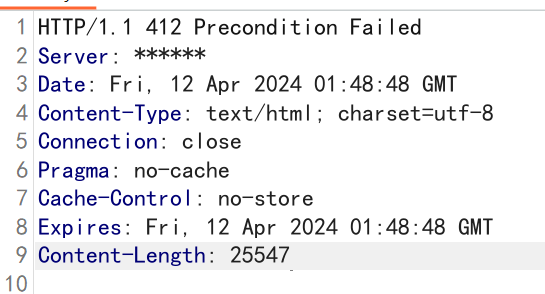

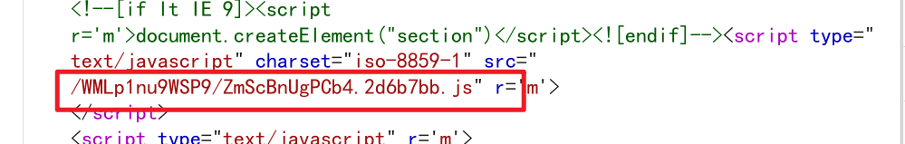

##### 2、访问请求和Cookie中带有动态加密的字符

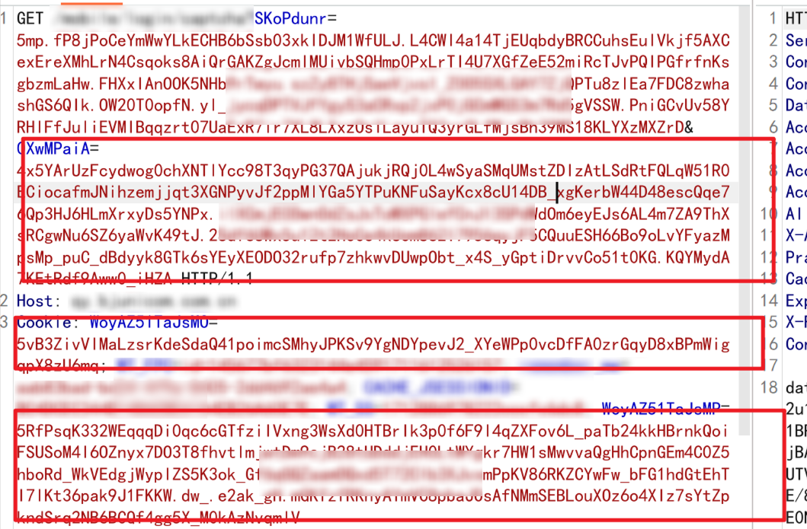

##### 3、重发请求时会返回400状态码

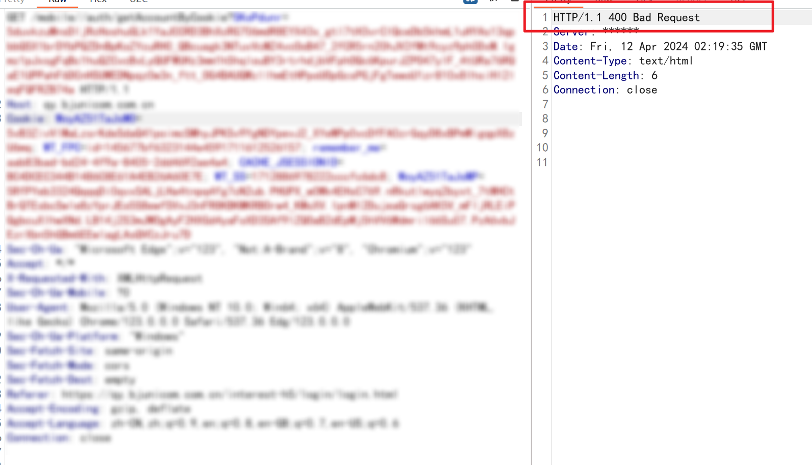

## 工具使用

### 前置准备

```
python3环境
所需的第三方库（pip install -r requirements.txt）
注意：版本不能过低（会有未知BUG）
注：程序默认使用到8765、8081、12931端口，如有端口冲突自行修改端口
```

装完三方库后，运行一下mitmdump，安装C:\Users\【用户名】\mitmproxy目录中mitmproxy-ca-cert.cer证书

### 使用方式

一键启动：

```
在脚本单独运行无报错情况下可使用一键启动.bat
```

#### 1、启动server程序

```
python server.py
或
start_server.bat
```

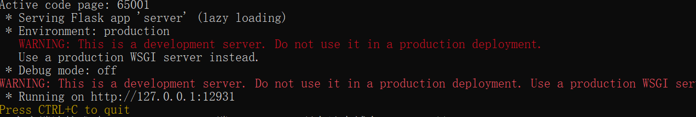

#### 2、执行mitmdump脚本

##### 使用mitmdump自动添加js（适合所有网站环境）

1、如访问网站非本机环境时，需要将ws通信地址修改成本机地址

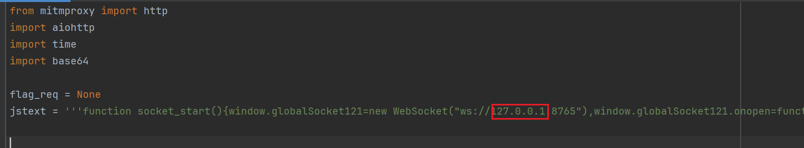

2、启动mitmdump

```
mitmdump -p 8081 -s mitmdump.py --ssl-insecure
或
mitmdump_start.bat
```

3、Burp添加上游代理

上游域名支持*，但建议测试哪些站点就配置哪些站点的上游

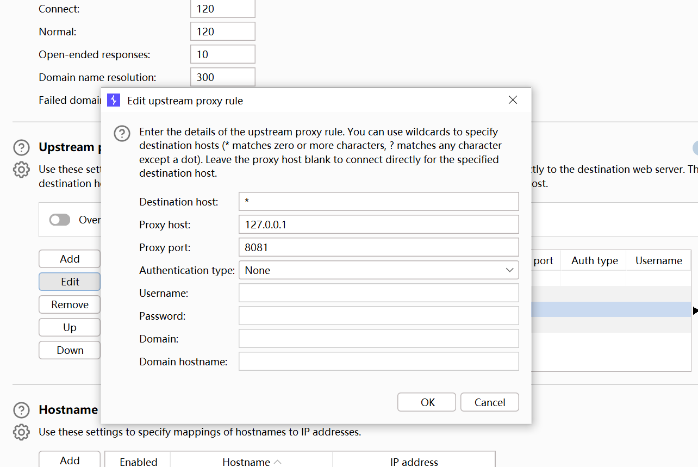

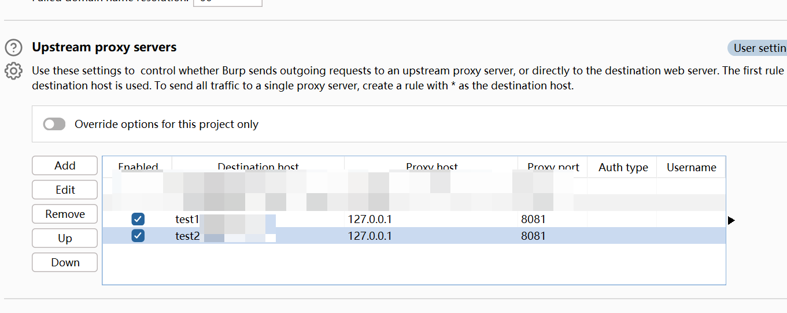

刷新目标网站，查看js和html地址内已自动添加指定js代码

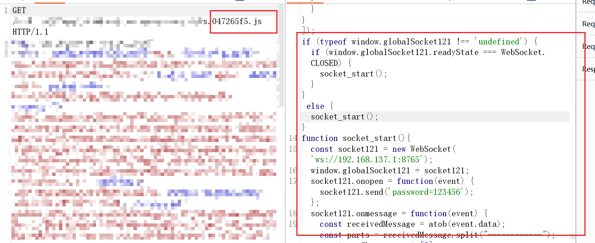

js代码执行成功，server端提示ws客户端连接成功，即可使用。

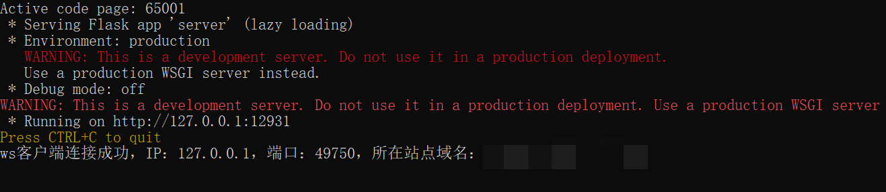

#### 3、进行重发请求

```
直接使用原请求包，header头中添加Req-flag: 1
```

例：

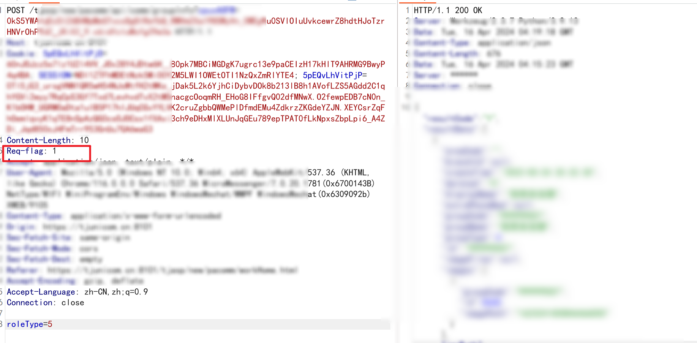

# 注意事项

```
1.默认网站响应超时时间5s
2.上游代理需指定域名或IP（不要填*）
3.批量请求时线程不要太大（针对网站响应耗时自行修改线程）
4.目标非本机环境（例如：模拟器、手机）下需修改【mitmdump.py】内的127.0.0.1:8765修改成x.x.x.x:8765
```

# 常见问题

#### 1、安装三方库报错

```
根据自己python版本安装合适三方库的版本
```

#### 2、请求后提示ws客户端未连接

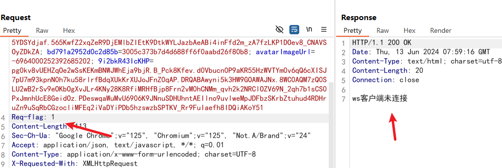

##### 排查：

1、上游代理挂上后刷新目标网站，查看js和html是否加载指定js

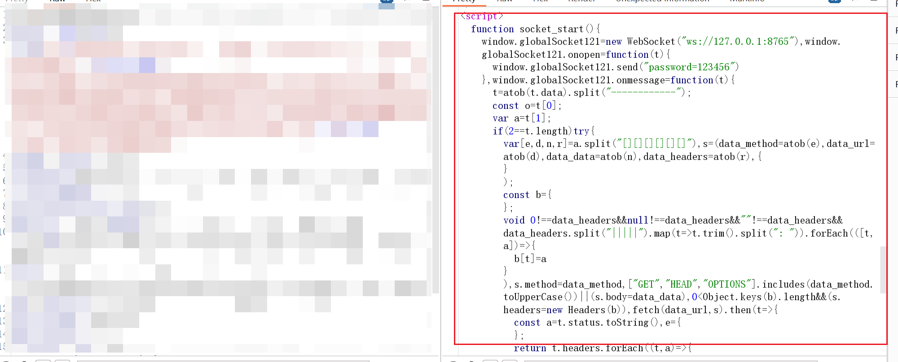

2、查看控制台是否存在相关报错

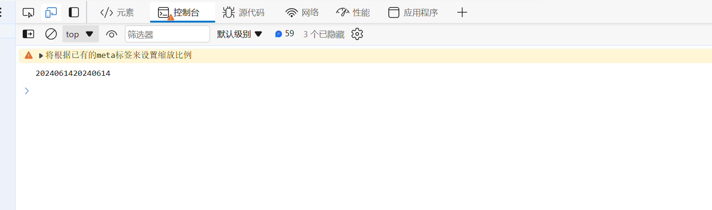

3、非本机环境时是否修改了ws的IP

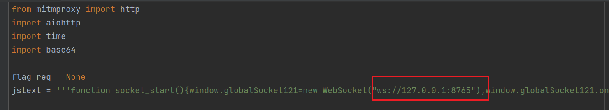

#### 3、提示网站访问失败

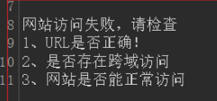


##### 排查：

1、查看请求的网站域名、端口、协议是否与目标网站相同（跨域）

2、使用mitmdump_debug.py，再次重发请求，查看浏览器控制台是否有报错

#### 4、提示发送给了ws客户端但是没有返回

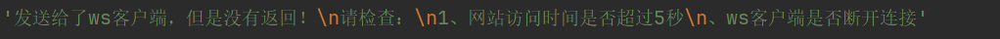

##### 排查：

1、刷新一下目标网站，查看server控制台有无连接提示

2、从历史请求查看是否已正常访问。下图标志【Res-flag】的请求，是【Req-flag】请求实际发出的，可以通过这个请求查看网站真实返回信息。

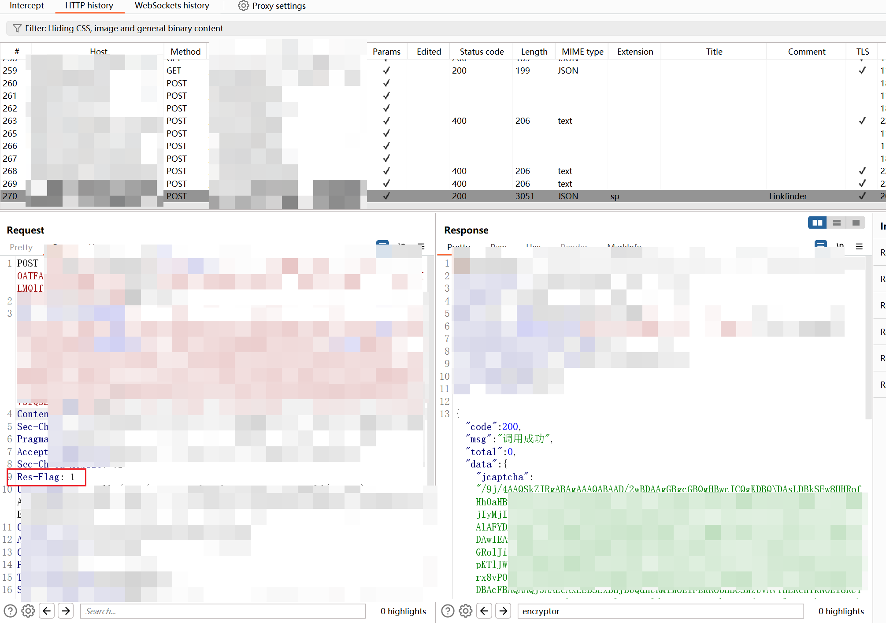

3、使用mitmdump_debug.py，再次重发请求，查看浏览器控制台是否有报错

#### 5、ws通信必须使用wss

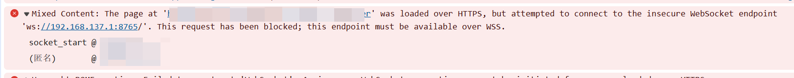

##### 解决：

1、申请一个域名和可信ssl证书

2、nginx反代ws和server

可以在本地指定host，本地使用nginx反代方式

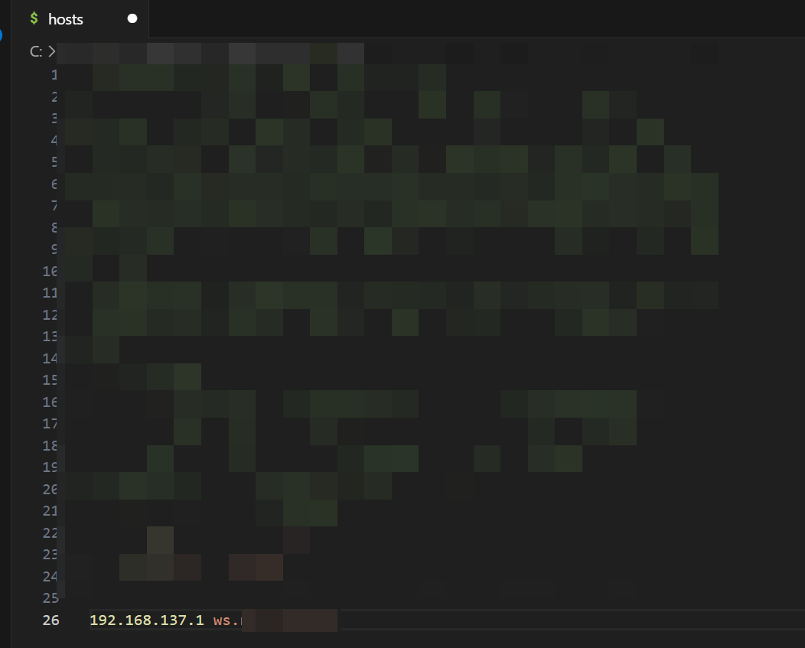

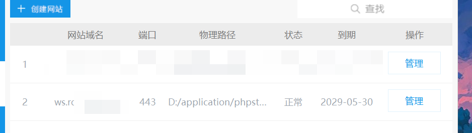

网站使用https

配置反代：

```
location ^~ /ws {
    proxy_pass http://127.0.0.1:8765; 
    proxy_set_header Host $host; 
    proxy_set_header X-Real-IP $remote_addr; 
    proxy_set_header X-Forwarded-For $proxy_add_x_forwarded_for; 
    proxy_set_header REMOTE-HOST $remote_addr; 
    proxy_set_header Upgrade $http_upgrade; 
    proxy_set_header Connection "upgrade"; 
    proxy_set_header X-Forwarded-Proto $scheme; 
    proxy_http_version 1.1; 
    add_header X-Cache $upstream_cache_status; 
    add_header Strict-Transport-Security "max-age=31536000"; 
    add_header Cache-Control no-cache; 
}
location ^~ /api {
    proxy_pass http://127.0.0.1:12931; 
    proxy_set_header Host $host; 
    proxy_set_header X-Real-IP $remote_addr; 
    proxy_set_header X-Forwarded-For $proxy_add_x_forwarded_for; 
    proxy_set_header REMOTE-HOST $remote_addr; 
    proxy_set_header Upgrade $http_upgrade; 
    proxy_set_header Connection "upgrade"; 
    proxy_set_header X-Forwarded-Proto $scheme; 
    proxy_http_version 1.1; 
    add_header X-Cache $upstream_cache_status; 
    add_header Strict-Transport-Security "max-age=31536000"; 
    add_header Cache-Control no-cache; 
}
```

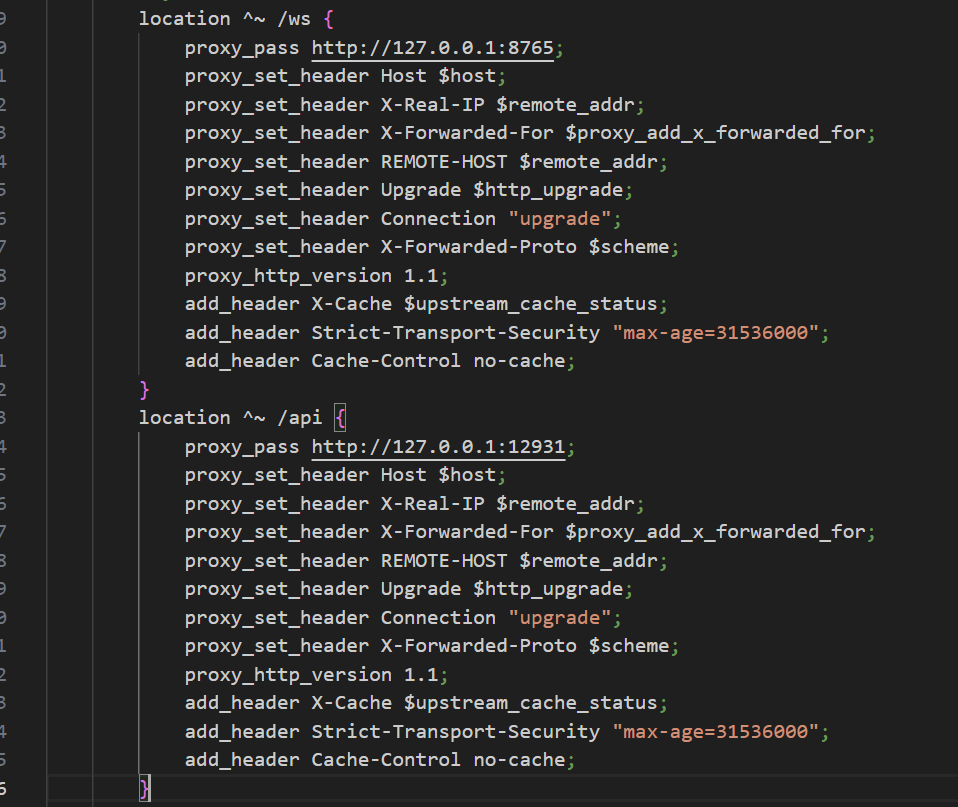

将【mitmdump.py】中

```
ws://192.168.137.1:8765
替换为
wss://你的域名/ws
```

```
http://127.0.0.1:12931/api
替换为
https://你的域名/api
```

# 更新日志

##### 2024年6月26日

支持多个站点同时重发请求

##### 2024年6月14日

更新~

##### 2024年4月25日

优化代码，解决已知BUG，更新v2.1版本

##### 2024年4月16日

更新v2.0版本

##### 2024年4月15日

修复已知问题

##### 2024年4月12日

v1.0版本发布


